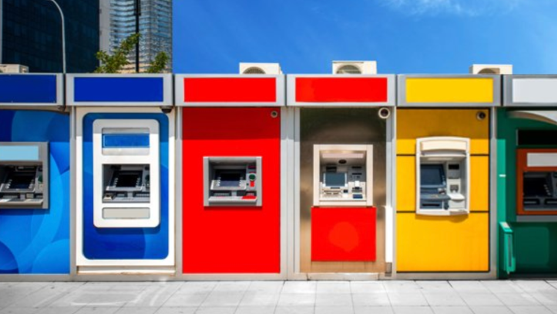

# Modelo Previsão Satisfação

  

## Descrição do Projeto

No Santander, nossa missão é ajudar as pessoas e os negócios a prosperar. Estamos sempre procurando maneiras de ajudar nossos clientes a entender sua saúde financeira e identificar quais produtos e serviços podem ajudá-los a atingir suas metas financeiras.

Nossa equipe de ciência de dados está continuamente desafiando nossos algoritmos de aprendizado de máquina, trabalhando com a comunidade global de ciência de dados para garantir que possamos identificar com mais precisão novas maneiras de resolver nosso desafio mais comum, problemas de classificação binária, como: um cliente está satisfeito? Um cliente comprará este produto? Um cliente pode pagar este empréstimo?

Neste desafio, convidamos os Kagglers a nos ajudar a identificar quais clientes farão uma transação específica no futuro, independentemente do valor em dinheiro transacionado. Os dados fornecidos para esta competição têm a mesma estrutura dos dados reais que temos disponíveis para resolver este problema.

Este projeto tem o intuito de ser um Modelo de Machine Learning para prever a insatisfação dos Clientes. A coluna ‘TARGET’ é a variável resposta. Ela é igual a 1 para clientes insatisfeitos e igual a 0 para clientes satisfeitos. Duas bases são dadas, uma para treino e uma para avaliação. Três são as tarefas a serem realizadas.

## Fundamentação Teórica

- [x] Fundamentos de GIT
- [x] SQL
- [x] Python
- [x] Análise de Dados 
- [x] Técnicas de Machine Learning
- [x] Modelagem Matemática e Estatística

## Status do Projeto

## Referências

[KAGGLE]([https://www.kaggle.com/competitions/santander-customer-transaction-prediction](https://www.kaggle.com/c/santander-customer-satisfaction/data)https://www.kaggle.com/c/santander-customer-satisfaction/data)
